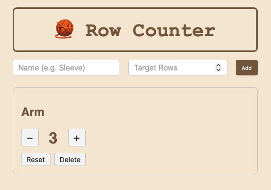

# 🧶 Row Counter

[View App](https://Lanaamen.github.io/RowCount/)

## About the project
Row Counter is a simple web-application to keep track on rows when crocheting or knitting.
You have the option to add multiple counters, add/sub rows, as well as resetting or deleting them.

## Tech
- HTML, CSS, JavaScript
- Vite – Builds the app for production
- Vitest – Tests
- GitHub Actions – CI/CD-pipeline conducts tests and deploys automatically
- GitHub Pages – Hosting platform

## CI/CD
Everytime code is pushed to the main-branch the pipeline automatically;
1. Installs dependecies
2. Runs tests
3. Builds the app
4. Deploys to Github Pages

## Lessons
As this has been the first time using CI/CD it has been a fun learing excerience. It has been cool to see a project come to, from idea to it being published. Even though it is a very simple app, for a crafter, this is a very helpful tool that I cant wait to continue working on and adding features to.